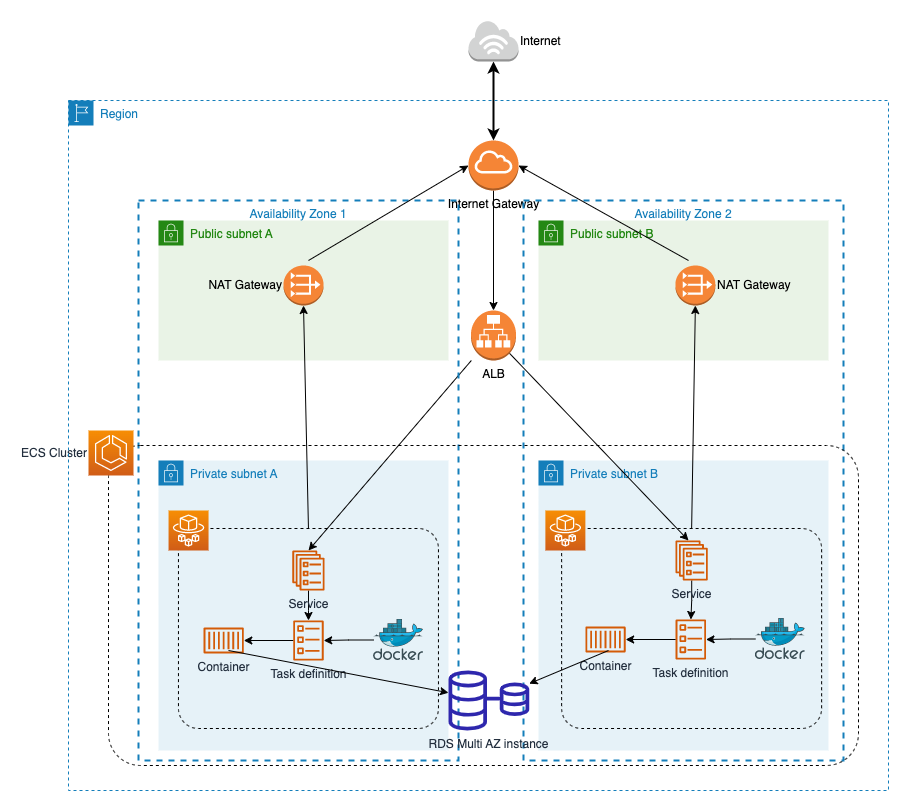

# Infrastructure as Code implementation

Into this folder ```./infrastructure_as_code/terraform``` the environment and terraform modules could be used for deploying the following infrastructure reference on AWS.
This implementation was made for deploying timeoff-management application in a high available and load balanced environment that serves HTTP/HTTPS through an application load balancer. All of HTTP requests are automatically redirected to HTTPS on the ALB.



## Installation

Use the [terraform cli](https://developer.hashicorp.com/terraform/downloads) to initialize and deploy the infrastructure.

On Ubuntu/Debian
```bash
wget -O- https://apt.releases.hashicorp.com/gpg | gpg --dearmor | sudo tee /usr/share/keyrings/hashicorp-archive-keyring.gpg
echo "deb [signed-by=/usr/share/keyrings/hashicorp-archive-keyring.gpg] https://apt.releases.hashicorp.com $(lsb_release -cs) main" | sudo tee /etc/apt/sources.list.d/hashicorp.list
sudo apt update && sudo apt install terraform
```

On MacOS
```bash
brew tap hashicorp/tap
brew install hashicorp/tap/terraform
```


## Usage

For this implementation you will need to have configured an SSL certificate either self-signed or issued by a CA on Aws Certificate Manager. Is also needed an IAM Role for executing tasks with secrets manager permission and docker credentials created as a Secret on Secret Manager.


There's a ```./terraform/environments/timeoff-prod/values.tfvars.example``` with required variables that can be set by using ```./terraform/environments/timeoff-prod/scripts/replaceEnvValues``` shell script as the example.

```bash
cd ./terraform/environments/timeoff-prod/
export EXECUTION_ROLE_ARN="arn:aws:iam::XXXXXXXXXX:role/ecsTaskExecutionRole"
export DOCKER_SECRET_ARN="arn:aws:secretsmanager:us-east-1:XXXXXXX:secret:docker/authkey"
export CERTIFICATE_ARN="arn:aws:acm:us-east-1:XXXXXXXXXX:certificate/468e9e18-d1fc-40a3-afeb-XXXXXXXXXXXX"
export MYSQL_DATABASE_NAME="database_production"
export MYSQL_DATABASE_USERNAME="userdba"
export MYSQL_DATABASE_PASSWORD="SecretPasswordExample"
./scripts/replaceEnvValues values.tfvars values.tfvars.example
```


Then you need to export the AWS environment variables for authenticating with AWS
```bash
export AWS_ACCESS_KEY_ID="AKIAQOEMKNIXXXXXXX"
export AWS_SECRET_ACCESS_KEY="tHLBwA/uM05SdWc/QtXXXXXXXXXXXXXX"
```
To finish you could initialize, plan and apply with terraform to deploy the infrastructure.
```bash
terraform init
terraform plan --var-file values.tfvars
terraform apply --var-file values.tfvars
```

## Contributing

Pull requests are welcome. For major changes, please open an issue first
to discuss what you would like to change.

Please make sure to update tests as appropriate.